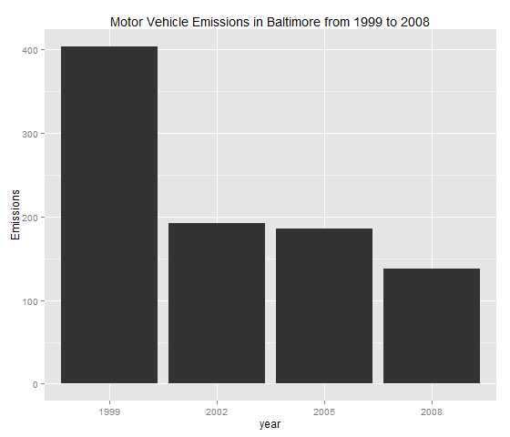
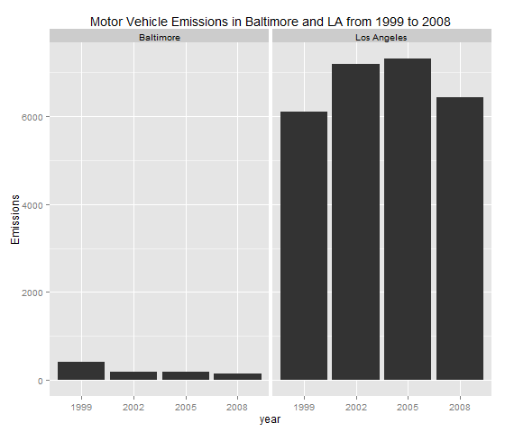

This document explains step by step the answers obtained using plot1.R, plot2.R, plot3.R, plot4.R, plot4.R, plot6.R. These files can be obtained here: https://github.com/dcgodoyg/jhudatasciencespecialization/tree/master/exploratory_data_analysis/project1

The data set used comes from the Environmental Protection Agency (EPA). This agency is tasked with setting national ambient air quality standards for fine PM and for tracking the emissions of this pollutant into the atmosphere. Approximatly every 3 years, the EPA releases its database on emissions of PM2.5. This database is known as the National Emissions Inventory (NEI). You can read more information about the NEI at the EPA National Emissions Inventory web site.

For each year and for each type of PM source, the NEI records how many tons of PM2.5 were emitted from that source over the course of the entire year. The data used are for 1999, 2002, 2005, and 2008.

####DATA

The data for this assignment are available from the course web site as a single zip file:

https://d396qusza40orc.cloudfront.net/exdata%2Fdata%2FNEI_data.zip

PM2.5 Emissions Data (summarySCC_PM25.rds): This file contains a data frame with all of the PM2.5 emissions data for 1999, 2002, 2005, and 2008. For each year, the table contains number of tons of PM2.5 emitted from a specific type of source for the entire year. Here are the first few rows.

             fips      SCC Pollutant Emissions  type year
        4  09001 10100401  PM25-PRI    15.714 POINT 1999
        8  09001 10100404  PM25-PRI   234.178 POINT 1999
        12 09001 10100501  PM25-PRI     0.128 POINT 1999
        16 09001 10200401  PM25-PRI     2.036 POINT 1999
        20 09001 10200504  PM25-PRI     0.388 POINT 1999
        24 09001 10200602  PM25-PRI     1.490 POINT 1999

#####Variables Description
fips: A five-digit number (represented as a string) indicating the U.S. county

SCC: The name of the source as indicated by a digit string (see source code classification table)

Pollutant: A string indicating the pollutant

Emissions: Amount of PM2.5 emitted, in tons

type: The type of source (point, non-point, on-road, or non-road)

year: The year of emissions recorded

####Assignment

#####Question 1: 
Have total emissions from PM2.5 decreased in the United States from 1999 to 2008? 

 

######Answer:

Yes, total emissions from PM2.5 in the United States from 1999 to 2008 have decreased

#####Question 2: 

Have total emissions from PM2.5 decreased in the Baltimore City, Maryland from 1999 to 2008?

 

######Answer:

Yes, total emissions from PM2.5 decreased in the Baltimore City, Maryland from 1999 to 2008.

####Question 3:

Of the four types of sources indicated by the type variable, which of these four sources have seen decreases in emissions from 1999–2008 for Baltimore City? Which have seen increases in emissions from 1999–2008?

 

######Answer:

Althoug point source type plummeted from 2005 to 2008, the last reading is still higher than it was in 1999.
Non-road, nonpoint and on-road have seen decreases from 1999 to 2008.

####Question 4:

Across the United States, how have emissions from coal combustion-related sources changed from 1999–2008?

 

######Answer:

Emissions from coal combustion-related decreased from 1999 to 2008.

####Question 5:

How have emissions from motor vehicle sources changed from 1999–2008 in Baltimore City?

 

######Answer:

Emissions from motor vehicle sources decreased from 1999–2008 in Baltimore City

#####Question 6:

Compare emissions from motor vehicle sources in Baltimore City with emissions from motor vehicle sources in Los Angeles. Which city has seen greater changes over time in motor vehicle emissions?

 

######Answer:

Los Angeles has seen greater changes over time in motor vehicle emissions.

