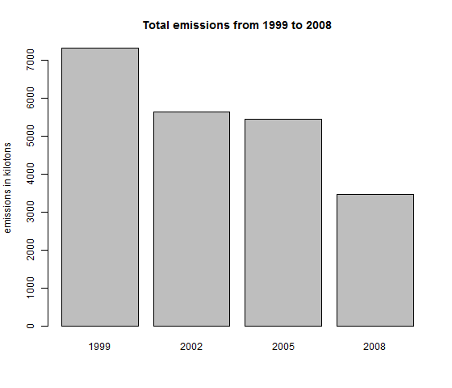
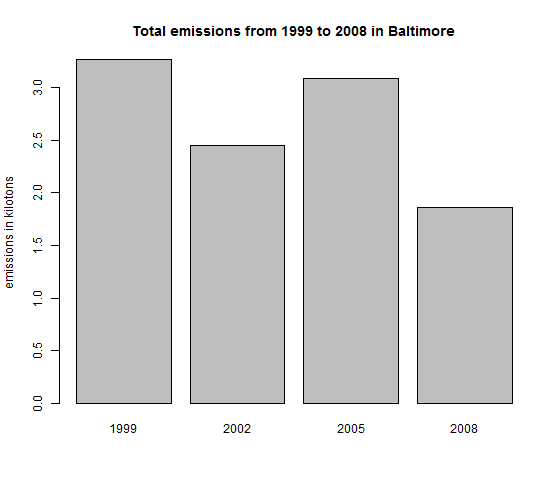
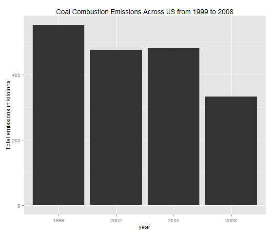

In this document you will find the answers obtained using plot1.R, plot2.R, plot3.R, plot4.R, plot4.R, plot6.R. These files can be obtained here: https://github.com/dcgodoyg/jhudatasciencespecialization/tree/master/exploratory_data_analysis/project1

####Assignment

#####Question 1: 
Have total emissions from PM2.5 decreased in the United States from 1999 to 2008? 

 

######Answer:

Yes, total emissions from PM2.5 in the United States from 1999 to 2008 have decreased

#####Question 2: 

Have total emissions PM2.5 decreased in Baltimore City, Maryland from 1999 to 2008?

 

######Answer:

Yes, total emissions from PM2.5 decreased in the Baltimore City, Maryland from 1999 to 2008.

####Question 3:

Of the four types of sources indicated by the type variable, which of these four sources have seen decreases in emissions from 1999–2008 for Baltimore City? Which have seen increases in emissions from 1999–2008?

 

######Answer:

Althoug point source type plummeted from 2005 to 2008, the last reading is still higher than it was in 1999.
Non-road, nonpoint and on-road have seen decreases from 1999 to 2008.

####Question 4:

Across the United States, how have emissions from coal combustion-related sources changed from 1999–2008?

 

######Answer:

Emissions from coal combustion-related decreased from 1999 to 2008.

####Question 5:

How have emissions from motor vehicle sources changed from 1999–2008 in Baltimore City?

 

######Answer:

Emissions from motor vehicle sources decreased from 1999–2008 in Baltimore City

#####Question 6:

Compare emissions from motor vehicle sources in Baltimore City with emissions from motor vehicle sources in Los Angeles. Which city has seen greater changes over time in motor vehicle emissions?

 

######Answer:

Los Angeles has seen greater changes over time in motor vehicle emissions.

