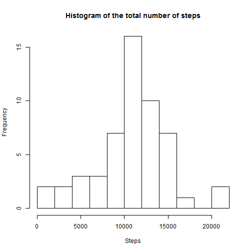
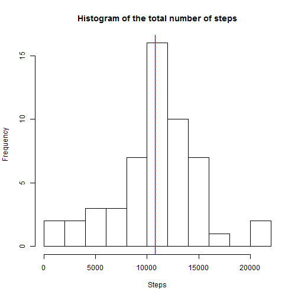
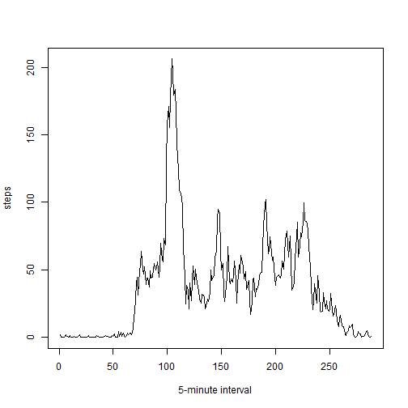
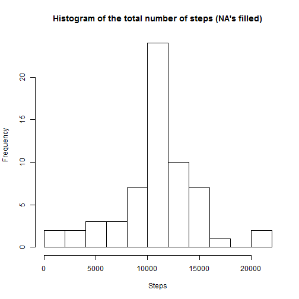
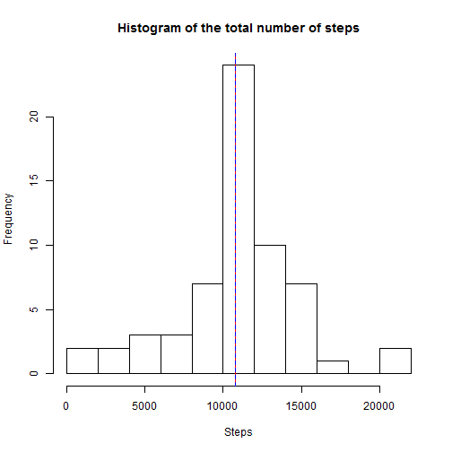
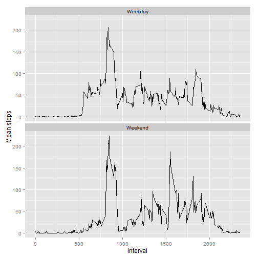

###### Prepare data

Unzip file, create directory, create data base in r.


```r
unzip("activity.zip", exdir="activitymonitoringdata")
activity.base <- read.csv("activitymonitoringdata/activity.csv")
head(activity.base, 10)
```

```
##    steps       date interval
## 1     NA 2012-10-01        0
## 2     NA 2012-10-01        5
## 3     NA 2012-10-01       10
## 4     NA 2012-10-01       15
## 5     NA 2012-10-01       20
## 6     NA 2012-10-01       25
## 7     NA 2012-10-01       30
## 8     NA 2012-10-01       35
## 9     NA 2012-10-01       40
## 10    NA 2012-10-01       45
```

##### 1) What is mean total number of steps taken per day?

For this part of the assignment, you can ignore the missing values in the dataset.

Calculate the total number of steps taken per day


```r
total.steps.day <- aggregate(. ~ date, activity.base, FUN = sum,
                             na.rm = TRUE)[ , -3]
head(total.steps.day)
```

```
##         date steps
## 1 2012-10-02   126
## 2 2012-10-03 11352
## 3 2012-10-04 12116
## 4 2012-10-05 13294
## 5 2012-10-06 15420
## 6 2012-10-07 11015
```

###### Make a histogram of the total number of steps taken each day


```r
hist(total.steps.day$steps, breaks = "FD", xlab = "Steps", 
     main = "Histogram of the total number of steps")
```

 

##### Calculate and report the mean and median of the total number of steps taken per day

In this case the mean is represented in the graph by a red line and the median
is represented in the graph by a dashed blue line.

The mean is:

```r
mean.steps.day <- mean(total.steps.day$steps)
mean.steps.day
```

```
## [1] 10766.19
```
  
The median is:

```r
median.steps.day <- median(total.steps.day$steps)
median.steps.day
```

```
## [1] 10765
```
The histogram is (mean-red line, median-blue line):

```r
hist(total.steps.day$steps, breaks = "FD", xlab = "Steps", 
     main = "Histogram of the total number of steps", abline = 1000)
abline(v = mean.steps.day, col = "red")
abline(v = median.steps.day, col = "blue", lty = "dashed")
```

 

##### 2) What is the average daily activity pattern?

###### Make a time series plot (i.e. type = "l") of the 5-minute interval (x-axis) and the average number of steps taken, averaged across all days (y-axis)


```r
average.steps.interval <- aggregate(. ~ interval, activity.base[ , -2],
                                    FUN = mean, na.rm = TRUE)
head(average.steps.interval)
```

```
##   interval     steps
## 1        0 1.7169811
## 2        5 0.3396226
## 3       10 0.1320755
## 4       15 0.1509434
## 5       20 0.0754717
## 6       25 2.0943396
```

```r
plot(average.steps.interval$steps, type = "l", xlab = "5-minute interval",
                                        ylab = "steps")
```

 

###### Which 5-minute interval, on average across all the days in the dataset, contains the maximum number of steps?

```r
which.max(average.steps.interval$steps)
```

```
## [1] 104
```
  
  
  
##### 3) Imputing missing values

###### Calculate and report the total number of missing values in the dataset (i.e. the total number of rows with NAs)


```r
sum(is.na(activity.base))
```

```
## [1] 2304
```

###### Devise a strategy for filling in all of the missing values in the dataset. The strategy does not need to be sophisticated. Create a new dataset that is equal to the original dataset but with the missing data filled in.  

  
  
We will populate NA's with mean for each interval.  


```r
activity.base.na <- activity.base[is.na(activity.base), ]
#merge columns
activity.base.merged <- merge(average.steps.interval, activity.base.na,
                                        by = "interval")[ , -3]
#reorganize columns
activity.base.merged <- activity.base.merged[ , c(2, 3, 1)]
colnames(activity.base.merged) <- c("steps", "date", "interval")
activity.base.completes <- activity.base[complete.cases(activity.base), ]
#create complete database without NA's
activity.base.no.na <- rbind(activity.base.merged, activity.base.completes)
head(activity.base.no.na)
```

```
##      steps       date interval
## 1 1.716981 2012-10-01        0
## 2 1.716981 2012-11-30        0
## 3 1.716981 2012-11-04        0
## 4 1.716981 2012-11-09        0
## 5 1.716981 2012-11-14        0
## 6 1.716981 2012-11-10        0
```

###### Make a histogram of the total number of steps taken each day and Calculate and report the mean and median total number of steps taken per day. Do these values differ from the estimates from the first part of the assignment? What is the impact of imputing missing data on the estimates of the total daily number of steps?  


```r
total.steps.day2 <- aggregate(. ~ date, activity.base.no.na, FUN = sum,
                              na.rm = TRUE)[ , -3]
head(total.steps.day2)
```

```
##         date    steps
## 1 2012-10-01 10766.19
## 2 2012-10-02   126.00
## 3 2012-10-03 11352.00
## 4 2012-10-04 12116.00
## 5 2012-10-05 13294.00
## 6 2012-10-06 15420.00
```


```r
hist(total.steps.day2$steps, breaks = "FD", xlab = "Steps", 
     main = "Histogram of the total number of steps (NA's filled)")
```

 
  
The mean after fill NA's is:  


```r
mean.steps.day2 <- mean(total.steps.day2$steps)
mean.steps.day2
```

```
## [1] 10766.19
```
  
The median after fill NA's is:  


```r
median.steps.day2 <- median(total.steps.day2$steps)
median.steps.day2
```

```
## [1] 10766.19
```
  
There is almost no difference between the data base containing NA's and the data base where NA's where replaced by the mean value for each interval. The impact of imputing only caused a higuer number of frequency counts. The histogram shpae, median and mean are almost the same.  


```r
hist(total.steps.day2$steps, breaks = "FD", xlab = "Steps", 
     main = "Histogram of the total number of steps", abline = 1000)
abline(v=mean.steps.day2, col = "red")
abline(v=median.steps.day2, col = "blue", lty = "dashed")
```

 

##### 4) Are there differences in activity patterns between weekdays and weekends?

Create a new factor variable in the dataset with two levels – “weekday” and “weekend” indicating whether a given date is a weekday or weekend day.

Make a panel plot containing a time series plot (i.e. type = "l") of the 5-minute interval (x-axis) and the average number of steps taken, averaged across all weekday days or weekend days (y-axis). See the README file in the GitHub repository to see an example of what this plot should look like using simulated data.


```r
library(lubridate)
library(ggplot2)
activity.base.no.na$date <- ymd(activity.base.no.na$date)
#set locale english
Sys.setlocale("LC_TIME", "English")
```

```
## [1] "English_United States.1252"
```

```r
activity.base.no.na <- cbind(activity.base.no.na,
                             day = weekdays(activity.base.no.na$date))

days <- as.data.frame(cbind(day = unique(levels(activity.base.no.na$day)),
                            type = c("Weekday", "Weekday", "Weekend",
                              "Weekday", "Weekend", "Weekday", "Weekday")))

acti.base.no.na.fact <- merge(days, activity.base.no.na, by = "day")
acti.base.no.na.fact.agg <- aggregate( . ~ type + interval,
                        acti.base.no.na.fact, FUN = mean)[ , c(1, 2, 4)]
```
  
The base looks like:

```r
head(acti.base.no.na.fact.agg, 10)
```

```
##       type interval       steps
## 1  Weekday        0 1.234133791
## 2  Weekend        0 2.966703663
## 3  Weekday        5 0.455403087
## 4  Weekend        5 0.039955605
## 5  Weekday       10 0.177101201
## 6  Weekend       10 0.015538291
## 7  Weekday       15 0.020583190
## 8  Weekend       15 0.488346282
## 9  Weekday       20 0.101200686
## 10 Weekend       20 0.008879023
```
  
The graph looks like:

```r
ggplot(acti.base.no.na.fact.agg, aes(x = interval, y = steps)) + geom_line() +
                facet_wrap(~ type, ncol = 1) + ylab("Mean steps")
```

 

Yes, there is a difference in activity patterns between weekdays and weekends. The mean for the early morning intervals seems to be higher in weekdays. The mean for the afternoon intervals seems to be higher in weekends. 


